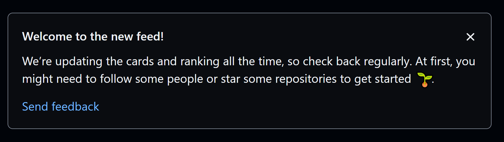

# React Dismissable Blurb Component
Built as a challenge from Joe Previte's [Free TypeScript Course](https://www.typescriptcourse.com/tutorials/build-a-dynamic-avatar-component-with-react-typescript)

# project requirements

## problem
build a `<DismissableBlurb />` component similar to the one on github


## requirements
- should render `children` components inside it 
	- required
- should have an "x" in the top-right corner
	- clicking the "x" should remove the element from the DOM

## api
- should combine JSDoc + TypeScript to provide good documentation

```tsx
<DismissableBlurb>
	<h3>Welcome to the new feed!</h3>
	<p>We're updating this to make it more interactive and useful.</p>
	<a href="https://example.com/feedback">Send feedback</a>
</DismissableBlurb>
```
